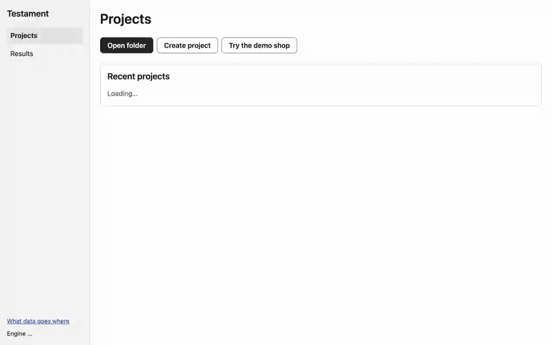
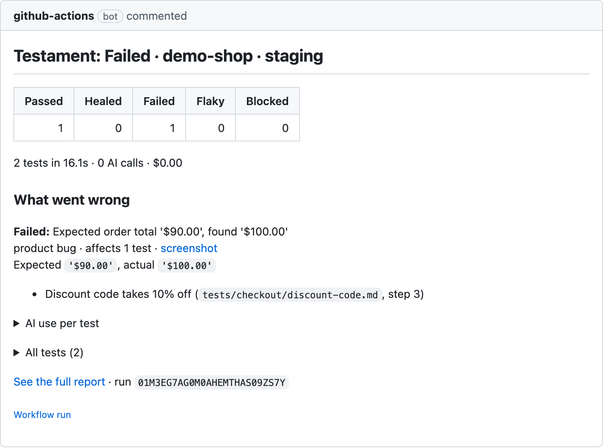

# Optestra

**Test your website or Android app from plain English.** The first run uses AI to
work out the steps and records them. Every later run replays the recording with
**no AI**, and every `Expect:` line is checked by plain code: a pass means a real
check passed.

```markdown
---
name: New customer can start a Pro trial
tags: [smoke, payments]
start: /pricing
auth: none
data:
  email: "{{unique.email}}"
timeout: 3m
---

1. Click "Start free trial" on the Pro plan
2. Sign up with {{data.email}} and password {{secret.SHOP_PASSWORD}}
3. Expect: the page heading is "Check your email"
4. Enter the code from the verification email and click "Verify"
5. Fill the card form with test card 4242 4242 4242 4242, expiry 12/34, CVC 123
6. Click "Start trial"
7. Expect: the page heading is "Welcome to Pro"
8. Expect: the URL contains /dashboard
9. Go to the billing page
10. Expect: the page shows "$0.00 due today"

Never: click "Delete account"
```

<table>
<tr>
<td width="55%" valign="top">

**Run it and watch** (the desktop app, replaying a recorded test of the demo shop: 0 AI calls, $0)



</td>
<td width="45%" valign="top">

**On every pull request** (the GitHub Action's one comment, updated in place)



</td>
</tr>
</table>

> All naming comes from [`packages/brand/brand.json`](packages/brand/brand.json).

## Install

Node 24. Then, in your web app's repository, with the app running:

```sh
npm install -D @optestra/cli
npx optestra init                          # project file, tests/example.test.md, .env.example, .gitignore lines
npx optestra author tests/example.test.md  # the AI does the steps once and saves the recording
npx optestra run                           # replays the recording: no AI when nothing changed
npx optestra report --open                 # the offline HTML report
```

The npm packages are published with the first release. Until then, build from
this repository (below) and run `node packages/cli/bin/cli.js` instead of `npx optestra`.

`init` asks three things (name, base URL, AI setup: your Claude or ChatGPT
subscription, an API key, or later), never overwrites a file, leaves an
existing Playwright setup alone and puts keys only in `.env`. For CI, pass
everything as flags: `npx optestra init --yes --name Shop --url http://localhost:3000 --ai claude-code`.
It ends with `doctor`, which you can run any time:

```sh
npx optestra doctor          # one line per check: ok / warn / FAIL, each problem with its fix
npx optestra doctor --json   # exit 0 all ok, 1 warnings with --strict, 2 any failure
```

Describe a test in one sentence and let it explore the app for a draft
(`init --suggest` proposes three starter tests the same way). Nothing is saved
until you say so:

```sh
npx optestra new "a returning user can log in and see the dashboard"          # prints the draft
npx optestra new "a returning user can log in and see the dashboard" --accept # saves it in tests/
```

Coding agents (Claude Code, Cursor, Codex) use the same tests through the MCP
server, `npx optestra mcp` (for Claude Code: `claude mcp add optestra -- npx
optestra mcp`), and the instructions in [integrations/](integrations/README.md).

The recorded test is also a plain Playwright spec you own:

```sh
npx optestra generate                        # tests/.optestra/*.spec.ts
npx playwright test -c tests/.optestra       # runs without this tool
npx optestra export --out ../my-playwright   # a standalone Playwright project
```

Timed on the demo shop (a copy of `bench/fixtures/shop` with no project file,
Claude Code subscription, the shop already running): `init` 0.8 s, `author`
of the example test 7.8 s (one AI call), `generate` 0.8 s, `npm install` 1.6 s,
plain `npx playwright test` 1.9 s: about 21 s of commands, plus the time to
answer `init`'s three questions.

**No API key?** If you pay for Claude or ChatGPT, install Claude Code or Codex
and sign in with its own command (`claude auth login` / `codex login`): the
engine uses it as its AI model, locked down (no shell, no files, no web), and
never touches its sign-in. `npx optestra login` shows what's ready. Google
subscriptions can't be used this way; use a Gemini API key.
[Details and vendor terms](docs/ai/subscription.md).

## The promises

1. **Your tests are yours.** Every recorded website test is also a plain
   Playwright spec in your repository that runs without Optestra.
   [If Optestra disappears](docs/if-it-disappears.md), nothing breaks.
2. **A pass means a real check passed.** Every `Expect:` line becomes a typed
   check that code evaluates; the verdict is decided by code, never by a model.
3. **Zero AI when nothing changed.** Replays use no model and cost nothing.
4. **Every fix is visible and reviewed.** A heal changes how a step is done,
   never what is checked, and waits for your approval by default.
5. **Clear about data.** Your key or your subscription, on your machine. The
   engine sends nothing to us: [what goes where](docs/security/data.md).
6. **It learns.** Steps worked out once are saved and reused, so each repeat
   run needs less AI than the last.

## Documentation

The docs site's source is in [`docs/`](docs/) (VitePress; page text uses
placeholders like `%Name%` that the build fills in from brand.json):

- Start: [what it is](docs/overview.md) · [desktop app](docs/quickstart/desktop.md) · [CLI in five minutes](docs/quickstart/cli.md)
- Write: [test files](docs/writing/test-files.md) · [steps](docs/writing/steps.md) · [variables](docs/writing/variables.md) · [flows](docs/writing/flows.md) · [lint rules](docs/writing/lint.md) · [environments](docs/environments.md) · [logins and inboxes](docs/auth.md)
- Run: [how a run works](docs/runs/how-a-run-works.md) · [checks and verdicts](docs/runs/checks-and-verdicts.md) · [healing](docs/runs/healing.md) · [AI models](docs/ai/models.md) · [costs](docs/ai/costs.md)
- CI: [GitHub Action](docs/ci/github-action.md) · [previews](docs/ci/previews.md) · [sharding](docs/ci/sharding.md) · [forks](docs/ci/forks.md) · [other CI](docs/ci/other-ci.md)
- Trust: [safety model](docs/security/safety-model.md) · [known limits](docs/security/limits.md)
- Reference: [CLI](docs/reference/cli.md) · [project file](docs/reference/config.md) · [JSON results](docs/reference/results-json.md) · [troubleshooting](docs/troubleshooting.md)

```sh
pnpm --filter ./docs dev      # the site at http://localhost:5173
pnpm --filter ./docs build    # static HTML in docs/dist, then the link and asset checks
```

## Developing the engine

Node 24 (see `.nvmrc`) and pnpm 10 (`corepack enable`; the version is pinned in `package.json`).

```sh
pnpm install
pnpm check          # format check, lint, typecheck, test, build (incl. the docs site), brand:check
pnpm build
npx optestra --version   # CLI from the workspace (name comes from brand.json)
```

The open-source (MIT) engine runs, records, replays and heals tests on its own,
with no account. The desktop app, web app and cloud consume it as normal packages.
See [ARCHITECTURE.md](ARCHITECTURE.md) and [CONTRIBUTING.md](CONTRIBUTING.md).

## Renaming

Edit `packages/brand/brand.json`, then run `pnpm brand:apply` here and in `apps/`.
`pnpm brand:check` fails if a product-name literal appears outside brand.json,
LICENSE, docs and lockfiles. The docs site reads every name from brand.json.
